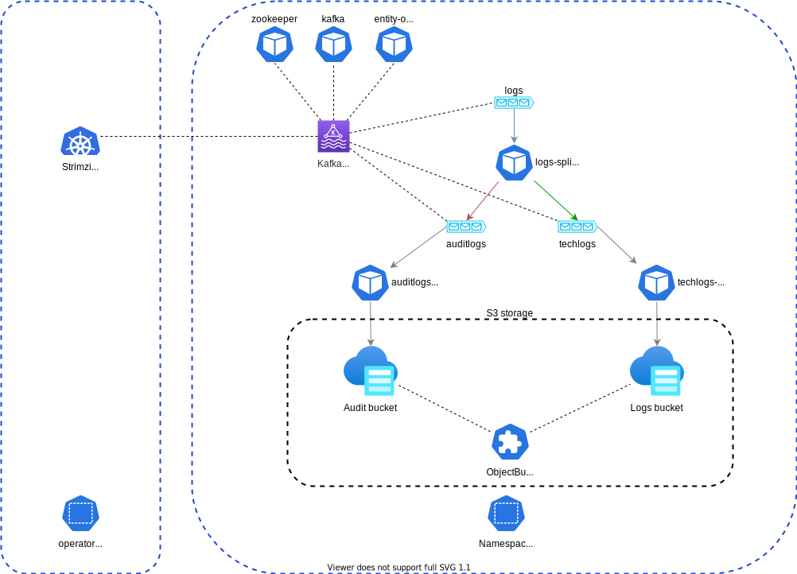

# observability-datahub-k8s-terraform
Read logs and metrics from Kafka topics and send them to S3, split GPDR logs and tech logs

## How it works



The *logs* topic contains json-based messages. Two key fields are used:
* `log_type` from the main message
* `_log_type` in the nested json-based data within `message`

If their value is *application*, then the nested json is extracted to the main message and the field is tested.

```json
{
    "log_type":"application",
    "message":"{\"_log_type\":\"audit\",\"message\":\"Hello World from app !\"}"
}
```

If their value is *audit*, then the message is routed to the *auditlogs* topic.

```json
{
    "log_type":"audit",
    "message":"Hello World from audit !"
}
```
## How to use it

Each resource is a terraform-based module:

* [logs-splitter-logstash](https://github.com/mgrzybek/terraform-module-k8s-logstash-logs-splitter): deploys a logstash service that splits the logs.
* [k8s-bucket-claim](https://github.com/mgrzybek/terraform-module-k8s-bucket-claim): creates s3 buckets using an ObjectBucketClaim.
* [strimzi-operator](./strimzi-operator): installs the Strimzi Kafka operator using the Openshift marketpace or OperatorHub.io on Kubernetes (Operator Subscription).
* [strimzi-cluster](./strimzi-claster): installs a Kafka cluster using the operator just installed before.
* logs-to-s3: *in progress*, will be based on a Fluentd agent using Kafka and S3 modules. We need to create a custom container because this is not included in the official release. See https://github.com/mgrzybek/fluentd-kafka-s3-logs-archiver

The provided Makefile can be used. You must create a Terraform variables file called `values.tfvars`.

For example:
```bash
$ cat values.tfvars
namespace          = "obs-datahub"
kafka_cluster_name = "datahub"
zk_replicas        = 3

source_topics = ["logs"]

storage_class = "openshift-storage.noobaa.io"

isOpenshift     = true
operatorSource  = "community-operator"
sourceNamespace = "openshift-marketplace"
startingCSV     = "strimzi-cluster-operator.v0.31.1"

$ make help
apply                Apply the plan
destroy              Destroy the deployment
help                 This help message
init                 Initialize the environment
plan.out             Create the plan
show-modules         Prints the modules
show                 Prints the resources
$ make apply
[…]
```

<!-- BEGINNING OF PRE-COMMIT-TERRAFORM DOCS HOOK -->
## Requirements

No requirements.

## Providers

| Name | Version |
|------|---------|
| <a name="provider_kubernetes"></a> [kubernetes](#provider\_kubernetes) | 2.14.0 |

## Modules

| Name | Source | Version |
|------|--------|---------|
| <a name="module_auditlogs_bucket"></a> [auditlogs\_bucket](#module\_auditlogs\_bucket) | git::https://github.com/mgrzybek/terraform-module-k8s-bucket-claim | n/a |
| <a name="module_auditlogs_topic"></a> [auditlogs\_topic](#module\_auditlogs\_topic) | git::https://github.com/mgrzybek/terraform-module-strimzi-topic | n/a |
| <a name="module_cluster"></a> [cluster](#module\_cluster) | ./strimzi-cluster | n/a |
| <a name="module_operator"></a> [operator](#module\_operator) | ./strimzi-operator | n/a |
| <a name="module_splitter"></a> [splitter](#module\_splitter) | git::https://github.com/mgrzybek/terraform-module-k8s-logstash-logs-splitter | n/a |
| <a name="module_techlogs_bucket"></a> [techlogs\_bucket](#module\_techlogs\_bucket) | git::https://github.com/mgrzybek/terraform-module-k8s-bucket-claim | n/a |
| <a name="module_techlogs_topic"></a> [techlogs\_topic](#module\_techlogs\_topic) | git::https://github.com/mgrzybek/terraform-module-strimzi-topic | n/a |

## Resources

| Name | Type |
|------|------|
| [kubernetes_namespace.logs](https://registry.terraform.io/providers/hashicorp/kubernetes/latest/docs/resources/namespace) | resource |

## Inputs

| Name | Description | Type | Default | Required |
|------|-------------|------|---------|:--------:|
| <a name="input_auditlogs_bucket"></a> [auditlogs\_bucket](#input\_auditlogs\_bucket) | Name of the bucket to create to store the audit logs | `string` | `"auditlogs"` | no |
| <a name="input_auditlogs_topic"></a> [auditlogs\_topic](#input\_auditlogs\_topic) | Target Kafka topic to push audit logs | `string` | `"audit"` | no |
| <a name="input_channel"></a> [channel](#input\_channel) | Channel used to download the operator | `string` | `"stable"` | no |
| <a name="input_isOpenshift"></a> [isOpenshift](#input\_isOpenshift) | Is it deployed on Openshift? | `bool` | `false` | no |
| <a name="input_kafka_cluster_name"></a> [kafka\_cluster\_name](#input\_kafka\_cluster\_name) | Name of the cluster created | `string` | `"kafka-logs"` | no |
| <a name="input_kafka_data_size"></a> [kafka\_data\_size](#input\_kafka\_data\_size) | Size of the PV claimed to store Kafka’s data | `string` | `"1Gi"` | no |
| <a name="input_kafka_replicas"></a> [kafka\_replicas](#input\_kafka\_replicas) | Number of data nodes deployed | `number` | `1` | no |
| <a name="input_namespace"></a> [namespace](#input\_namespace) | The namespace used to deploy the module | `string` | n/a | yes |
| <a name="input_operatorSource"></a> [operatorSource](#input\_operatorSource) | n/a | `string` | `"operatorhubio-catalog"` | no |
| <a name="input_sourceNamespace"></a> [sourceNamespace](#input\_sourceNamespace) | Marketplace used to download the operator | `string` | `"olm"` | no |
| <a name="input_source_topics"></a> [source\_topics](#input\_source\_topics) | Names of the topics to listen to | `list(string)` | <pre>[<br>  "logs"<br>]</pre> | no |
| <a name="input_splitter_replicas"></a> [splitter\_replicas](#input\_splitter\_replicas) | Number of replicas to deploy | `number` | `1` | no |
| <a name="input_startingCSV"></a> [startingCSV](#input\_startingCSV) | Version to install | `string` | `"strimzi-cluster-operator.v0.31.1"` | no |
| <a name="input_storage_class"></a> [storage\_class](#input\_storage\_class) | Storage class to use in the ObjectBucketClaim | `string` | n/a | yes |
| <a name="input_techlogs_bucket"></a> [techlogs\_bucket](#input\_techlogs\_bucket) | Name oh the bucket to create to store the technical logs | `string` | `"techlogs"` | no |
| <a name="input_techlogs_topic"></a> [techlogs\_topic](#input\_techlogs\_topic) | Target Kafka topic to push technical logs | `string` | `"techlogs"` | no |
| <a name="input_zk_data_size"></a> [zk\_data\_size](#input\_zk\_data\_size) | Size of the PV claimed to store Zookeeper’s data | `string` | `"1Gi"` | no |
| <a name="input_zk_replicas"></a> [zk\_replicas](#input\_zk\_replicas) | Number of pods deployed for Zookeeper | `number` | `1` | no |

## Outputs

No outputs.
<!-- END OF PRE-COMMIT-TERRAFORM DOCS HOOK -->
